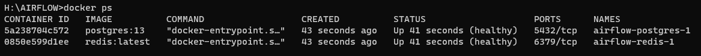

# AIRFLOW 

+ Tạo thư mục lưu trữ log, plugin, file download, dag: `mkdir ./dags ./plugins ./logs ./downloads`. Trên Linux, cần thiết lập group id = 0. Nếu không, các tệp được tạo trong dags, plugins và logs sẽ được tạo bằng người dùng root: `echo -e "AIRFLOW_UID=$(id -u)\nAIRFLOW_GID=0" > .env`
+ Dùng lệnh sau để build, truyền `.env` vào `--build-arg`:
```bash
export $(cat .env | xargs) && \
docker build --build-arg http_proxy=$http_proxy --build-arg https_proxy=$https_proxy -t airflow-proxy-image .
```
+ Run: `docker-compose up airflow-init` để cài đặt và khởi tạo csdl postgresql, redis.



+ Run: `docker-compose up` để khởi động tất cả các services
+ Truy cập UI: localhost:8089
+ Run `docker-compose down && docker-compose up` để cập nhật lại các thành phần trong file `doccker-composer.yaml` vào các container
+ Check Airflow version in Docker: `docker exec [container_id] airflow version`


+ Tạo user: `airflow users  create --role Admin --username hau.nguyentrung --email hau.nguyentrung@mobifone.vn --firstname Hau --lastname Nguyen --password 12345678`


## Lỗi:
+ Airflow scheduler does not appear to be running after execute a task:

    Run statement: `docker exec [container_id] airflow scheduler`