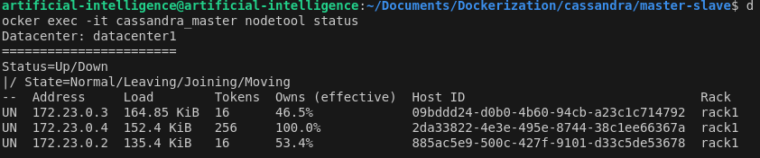

# Cassandra Master-Slave
+ Khởi tạo Cluster: `docker-compose up -d`
+ Kiểm tra Trạng Thái Cluster: `docker exec -it cassandra_master cqlsh` và để kiểm tra các node trong cluster: `SELECT * FROM system.peers;`. Điều này sẽ hiển thị tất cả các node trong cluster, bao gồm cả master và các slave. Nếu kết quả trả về từ câu lệnh `SELECT * FROM system.peers;` là NULL thì kiểm tra log của container: `docker logs  cassandra_slave1`


Cassandra slave (cassandra_slave1) không thể kết nối tới Cassandra master (cassandra_master) qua cổng 7000 (cổng giao tiếp giữa các node trong cluster).

Cụ thể, lỗi ConnectTimeoutException: connection timed out nghĩa là Cassandra slave không thể thiết lập kết nối với Cassandra master trong thời gian quy định, có thể là do tường lửa hoặc cấu hình mạng Docker ngăn chặn port 7000. Thêm rule cho phép application giao tiếp trên cổng 7000:

```
sudo iptables -A INPUT -p tcp --dport 7000 -j ACCEPT
sudo iptables -A OUTPUT -p tcp --dport 7000 -j ACCEPT
sudo iptables-save
```

Khởi động lại Docker và Containers:

```
docker-compose down
docker-compose up -d
```

Sử dụng câu lệnh **nodetool** để kiểm tra trạng thái của các node trong cluster. Nếu node nào chưa được kết nối đúng cách, sẽ thấy các vấn đề rõ ràng hơn: `docker exec -it cassandra_master nodetool status`




