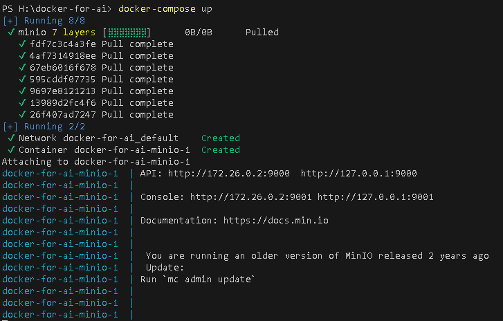
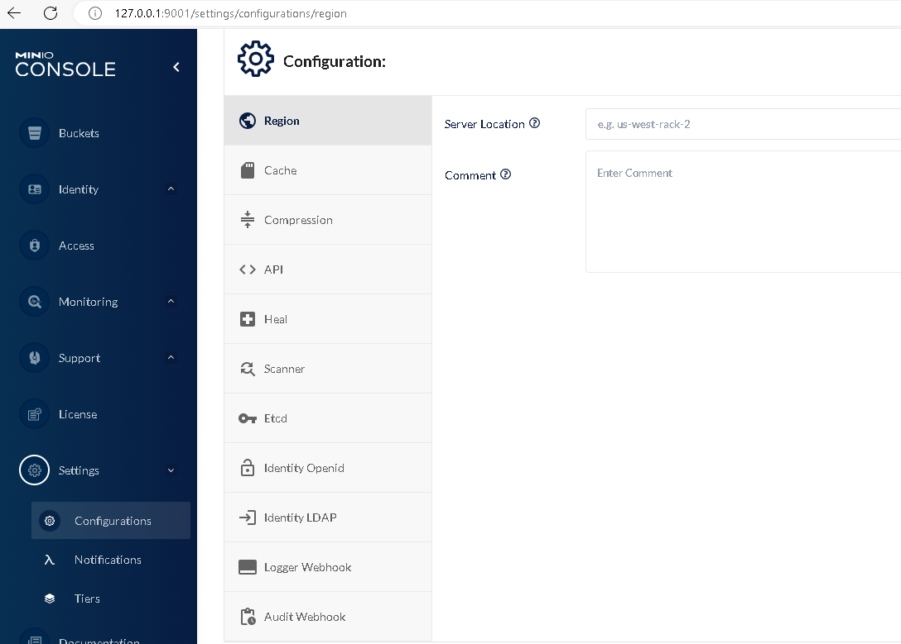

# MINIO
Cài đặt MinIO trong docker:
+ Tạo thư mục **data** để ánh xạ dữ liệu từ thư mục gốc trong Docker
+ Chạy câu lệnh ```docker-compose up```



Truy cập MinIO trên localhost: http://127.0.0.1:9001/




