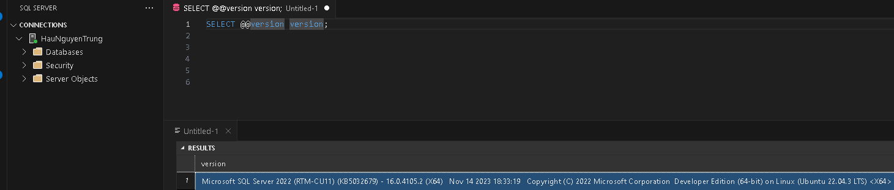

# SQL Server
+ Khởi động SQL Server trong Docker: 
  + Tạo 3 thư mục **data, log, secrets** trên máy tính để ánh xạ dữ liệu của SQL Server trong Docker ra PC 
  + `docker-compose up`

  

+ Kết nối MSSQL trong Docker với Visual Studio Code
  + Cài đặt extension SQL Server trong VS Code

  

  + Kết nối đến SQL Server container với Visual Studio Code
    + Tạo kết nối với tên server: `localhost,1433` hoặc `127.0.0.1,1433`

    

    + Nhập tên cơ sở dữ liệu hoặc nhấn **Enter** để tiếp tục

    

    + Chọn SQL Login với tên đăng nhập user sa, password
    + Nhập tên hiển thị trên kết nối Docker

    

    + Kiểm tra phiên bản SQL Server:

    
    

